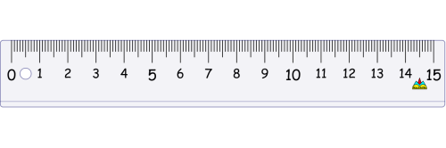

# Binary Search

Binary search is an efficient algorithm used to find the position of a target item within a sorted collection of items.

Here's an explanation of how you can search for a word in a dictionary using the binary search algorithm explained by ChatGPT:

> 1. First, you need to have a sorted collection of words, for example, an alphabetically sorted list of words in a dictionary.
> 2. Then, you set a pointer in the middle of the collection of words and compare the target word to the word at the pointer.
> 3. If the target word is equal to the word at the pointer, you have found the correct word and can stop the search.
> 4. If the target word is less than the word at the pointer, you repeat the search in the first half of the collection.
> 5. If the target word is greater than the word at the pointer, you repeat the search in the second half of the collection.
> 6. Repeat this process of dividing the collection in half and comparing the target word to the word at the pointer until the word is found or it is determined that the word does not exist in the collection.

I finally got it when I thought of binary search as a way to find an object in a list with a ruler (yardstick).

Let's say we arrange fruits ordered by its name on the table. Apple, banana, cherry, durian, dates, eggfruit, and tangerine. 

Imagine that table has a big ruler right below it to tell you each item's position. We place apple at 0, banana at 1, cherry at 2, durian at 3, dates at 4, eggfruit at 5, and tangerine at 6. We cover the table with the black sheets.

Tell your friend, "Hey, I arrange fruits ordered by its name on this table. If you can guess the position of eggfruit, I'll give you 10 bucks! What do you say?"

Your friend is up for the challenge!

Your friend can only ask "Is this it?" and point at the ruler no more than 3 times. You can only answer, "Nope, move right further", "Nope, move left further", or "Yes, you got it! Here's your money!"

Your friend is a computer scientist. He probably can figure it out.

He starts his first try at the middle (number 3) and ask, "Is this it?"

You'd say, "Nope, move right further".

You friend contemplates, "Hmmm, it is no use guessing the other half. How can I find the new middle position?"

He moves the current rightmost position (number 6) to the right (number 7) and split it into halves.

He use `Math.floor` to find it. What is the result of 7 divided by 2 using `Math.floor`? It's still 3.

He moves the current rightmost position to the right (number 8) and split them into halves again. It's 4.

Again, he asks, "Is this it?" and point his finger at the ruler (number 4).

You'd say, "Nope, move right further".

He moves the current rightmost position to the right (number 9) and split them into halves again. It's still 4.

He moves the current rightmost position to the right (number 10) and split them into halves again. It's 5.

Again, he asks, "Is this it?" and point his finger at the ruler (number 5).

You answer, "Yes, you got it! Here's your money!"
